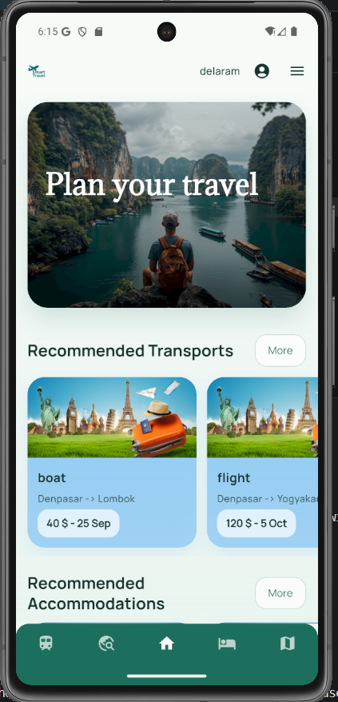
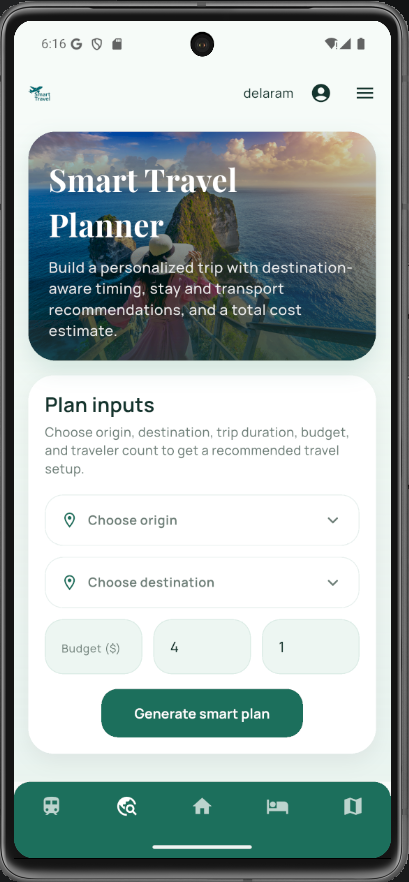
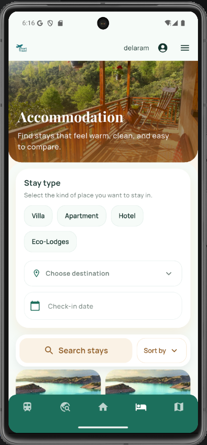
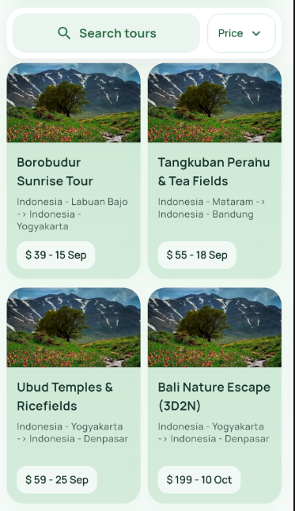
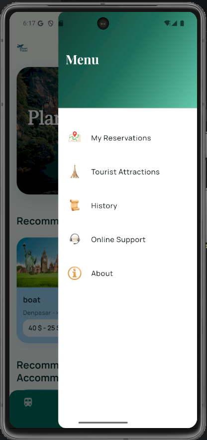
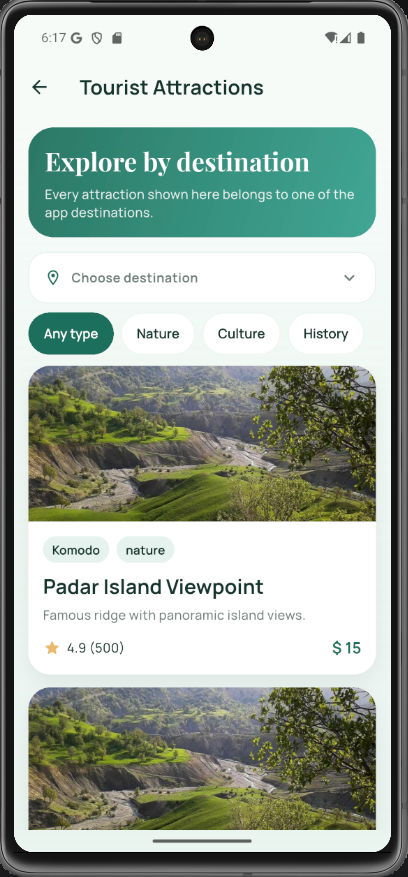
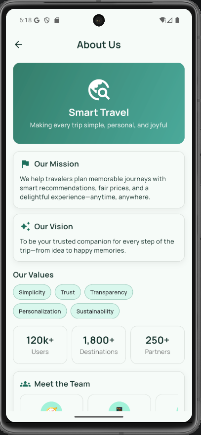

## Project Overview

This repository contains a **Tourism Mobile Application** developed as a university project for the Mobile Development course.

The goal of this application is to simplify travel planning for users with different budgets and time constraints by providing an all-in-one platform for booking, planning, and discovering travel experiences.

The application supports features such as:
- user registration and authentication,
- booking tickets for trains, flights, buses, and ships,
- accommodation booking (hotels, guesthouses, eco-lodges, and home rentals),
- tour booking for domestic and international trips, including nature tours with recommended equipment,
- searching for tourist attractions, restaurants, and points of interest,
- smart travel planning based on destination, budget, and trip duration,
- travel cost estimation and best travel time suggestions,
- offline access to selected tour and accommodation information,
- basic user feedback and support functionalities.

The app is developed using **Flutter** to provide a single cross-platform codebase for Android and iOS.  
For the backend, **Firebase** is used as a Backend-as-a-Service solution, including Authentication, Firestore for structured data, Cloud Storage for media content, and notification services.

The project focuses on delivering a practical, user-centered tourism application while applying mobile development and cloud-based architecture concepts.

## 📱 Smart Travel App – UI Screens

### 🏠 Home Screen

A visually engaging home screen that introduces users to travel planning. It highlights recommended transports, destinations, and tours.

---

### ✨ Smart Travel Planner

An intelligent planning interface where users can input trip details such as origin, destination, budget, and duration to generate a personalized travel plan.

---

### 🏨 Accommodation Finder – Stay Booking

A clean and user-friendly screen that allows users to search and filter accommodations by type, destination, and check-in date.

---

### 🌄 Tours & Experiences – Exploration

A list of tours available on the Tour Finder page.

---

### 📋 Navigation Menu – User Dashboard

A side navigation menu providing quick access to important sections such as reservations, attractions, history, support, and more.

---

### 📍 Tourist Attractions – Destination Explorer

An exploration screen where users can browse attractions by destination and category, with ratings, descriptions, and pricing details.

---

### ℹ️ About Us – App Overview

An informational page presenting the app’s mission, vision, values, and key statistics to build user trust and clarity.
